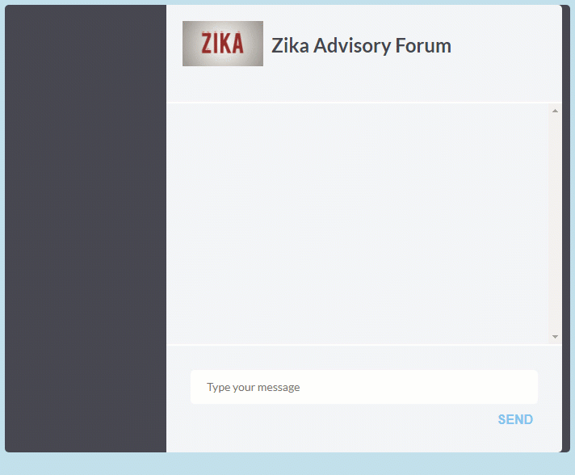
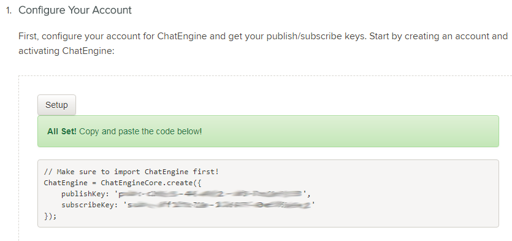
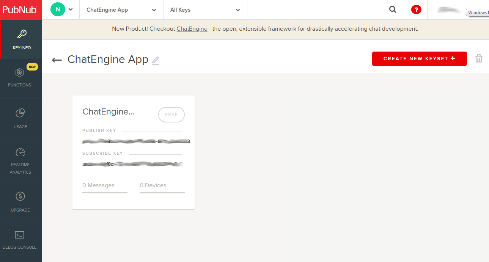
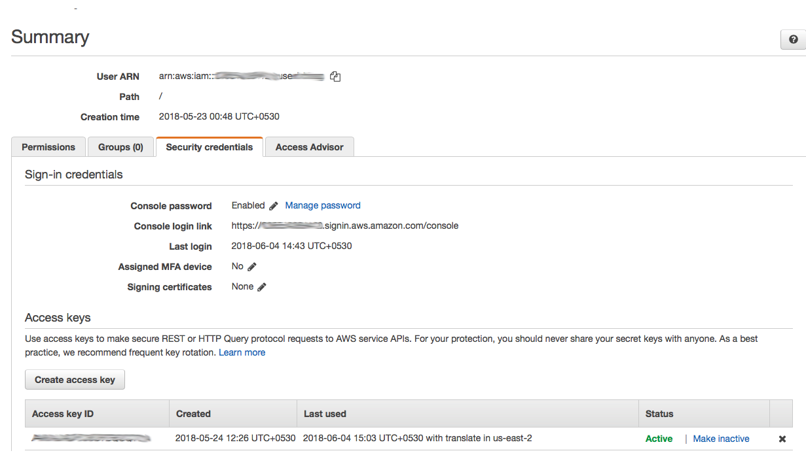
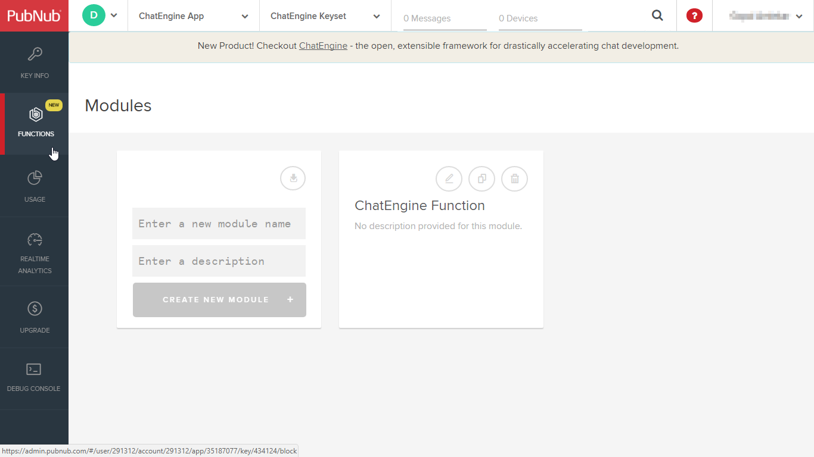
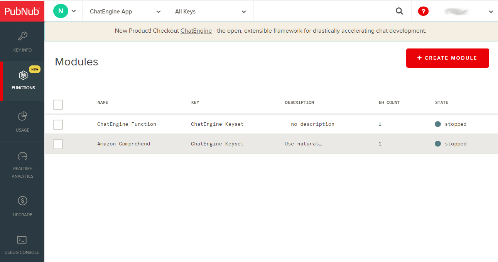
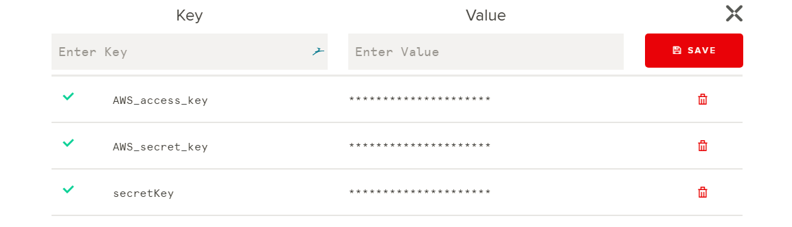
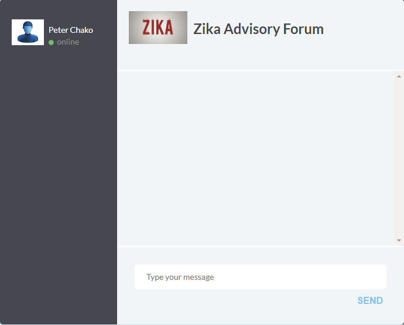

# A ChatRoom With Topic Discovery Based on Locations

Follow this README to build your forum chat room with the help of PubNub ChatEngine and AWS Comprehend. This forum chat room, provides the functionality of a chat room with the ability to suggest topics based on locations. 

This repository contains the demo application for this forum chat room, along with a simulated chat session between a groupl of users. The source code for this chat app is in Javascript. Some level of familiarity with NodeJS, JQuery and standard Javascript language is expected.
 
For reference, you can check the documentation of [PubNub Chat Engine](https://www.pubnub.com/products/chatengine/), [PubNub Functions](https://www.pubnub.com/products/functions/) and [AWS Comprehend](https://aws.amazon.com/comprehend/), which are the main components of this app. 

Here is how the simulated chat session runs. It is depicting a public health advisory chat room about Zika Virus, and it generates "HeatTags" for all the locations mentioned in the chat messages. This indirectly indicates the impact and spread of Zika Virus in those locations. 

You can follow the sections below to build this example chat app in no time. However, before you begin, you must have an account in PubNub and AWS.

Create your [PubNub developer account](https://admin.pubnub.com/)

Create your free [AWS account](https://portal.aws.amazon.com/billing/signup#/start)

## [Set Up Basic ChatEngine](#set-up-basic-chatengine)

First, you need to set up the ChatEngine enabled PubNub app in your account. 

### Step 1 : Login to your [PubNub App Console](https://admin.pubnub.com)

### Step 2 : Activate ChatEngine in your PubNub account

Follow these steps in [ChatEngine QuickStart Tutorial](https://www.pubnub.com/docs/tutorials/chatengine#step-one-pubnub-keys) to set up your chat app instance. Check the first step "Configure Your Account" in quickstart tutorial and click on the setup button.

### Step 3 : Wait for a few seconds. Once done, you will get a new PubNub app created within your account with a new set of publish and subscribe keys. 

### Step 4 : Check that a new app is created in your PubNub admin dashboard.

Now your app infrastucture is created. Head over to the next section for setting up AWS Comprehend.

## [Set Up AWS Comprehend Service](#set-up-aws-comprehend-service)

Follow these steps to setup your AWS Comprehend service

### Step 1 : Setup an IAM user to access AWS Comprehend service

Follow [these steps](https://docs.aws.amazon.com/comprehend/latest/dg/setting-up.html) to create an IAM user for AWS Comprehend. Make sure that the IAM user has full permissions for accessing AWS Comprehend service.

### Step 2 : Download the IAM user credentials

Download the credentials file for the IAM user and save it. This file contains the AWS ACCESS KEY and AWS SECRET KEY.

## [Set Up PubNub Function for AWS Comprehend](#set-up-pubnub-function-for-aws-comprehend)

Follow these steps to setup PubNub Function to serve as the backend for the forum chat app.

### Step 1 : Setup PubNub Function

Head over to your PubNub dashboard and select the "ChatEngine App" app. Follow the official document of [PubNub Function](https://www.pubnub.com/products/functions/) to create a function for this app by clicking on the "Functions" menu on the sidebar.

### Step 2 : Create a new module under functions

Create a new module within the functions tab by using the following parameters as mentioned in the form.

Enter a module name : Amaon Comprehend 
Enter a module description : Use natural language classification to find locations in text 
Which keyset should this module go under? : ChatEngine keyset

Under the module, create a new PubNub function by using the following parameters as mentioned in the form.

Function Name : Amazon Comprehend 
Select an event type : Before Publish of Fire

Once done, you will have two modules. First one is created by default as part of ChatEngine App and the new one is created in this step.

### Step 3 : Launch the PubNub function

Copy the [AWS Comprehend backend code](https://github.com/shyampurk/ChatEngineWithAWSTranslate/blob/master/function/AWS%20Transalte%20backend.js) and paste it in the code window of the newly created PubNub function in previous step. 

Add your AWS ACCESS KEY and AWS SECRET KEY (Step 2 of "Set Up AWS Comprehend Service") in the My Secrets vault as shown below. 

Now start both the modules within the functions tab. 

## [App Deployment and Running The Simulated Chat Session](#app-deployment-and-running-the-simulated-chat-session)

Follow these steps to test the app.

### Step 1 : Clone this repository

Clone this repository under a local folder

### Step 2 : Update PubNub keys for chat UI

Update the chat UI's PubNub publish key [here](https://github.com/shyampurk/ChatEngineWithAWSComprehend/blob/master/UI/scripts/chatComprehend.js#L3) and PubNub subscribe key [here](https://github.com/shyampurk/ChatEngineWithAWSComprehend/blob/master/UI/scripts/chatComprehend.js#L4) 

### Step 3 : Update PubNub keys for the dummy users

There are five dummy users defined for the simulated session of this app. These users are represented by their individual NodeJS scripts.

1. [Moderator (Zika Advisor)](bot/app.js)

2. [Don](bot/users/userDon.js)

3. [John](bot/users/userJohn.js)

4. [Ron](bot/users/userRon.js)

5. [Shaun](bot/users/userShaun.js)

For the moderator, update the PubNub Publish and Subscribe Keys at the line 18 & 19 of the script file.

For the remaining users, update the PubNub Publish and Subscribe Keys at the line 6 & 7 of the respective user's script file.

### Step 4 : Launch the chat room UI 

Now you are ready to launch the app instance. Before launchign the app make sure that the AWS Comprehend PubNub Function is running.

To launch the chat room UI, you can open the [chat room HTML file](UI/zikaforum.html) in a browser. Once you do that you will notice that the user named "Peter" has joined the chat. This is the human user which participates in the chat. 

### Step 5 : Launch the chat session simulation

To launch the simulation, start the [moderator bot](bot/app.js) under the NodeJS environment.

    node app.js

CAUTION : Before launching the above command for the first time, make sure the install the node module dependencies

    npm install

Have fun!

